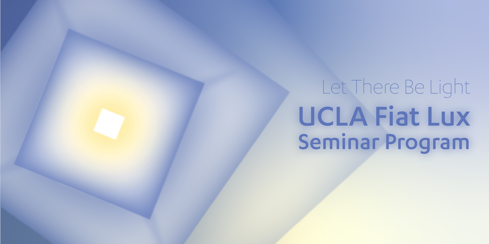

## Coming soon: Fiat Lux Seminar, Hosted by UCLA

Join the Quantum Ethics Project as we develop first-of-its-kind Coursework on Quantum Ethics. We are currently organizing a 10 lecture series on Quantum Ethics, to be delivered January 2023. ALL ARE WELCOME! - [Sign up Link](https://www.uei.ucla.edu/academic-programs/fiat-lux/)

> We are actively looking for colaborators - [Click Here to Get Involved](default.com)

- [paper 1](default.com)
- [paper 2](default.com)
- [paper 3](default.com)
